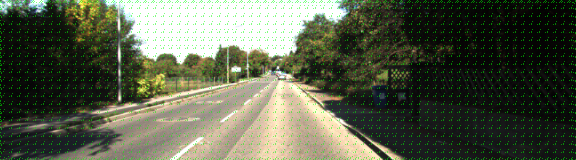
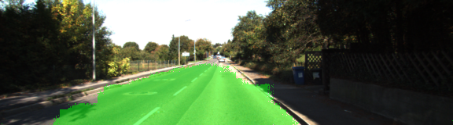
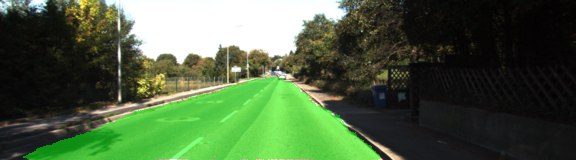

# Semantic Segmentation
### Introduction
In this project, you'll label the pixels of a road in images using a Fully Convolutional Network (FCN).

### Setup
##### GPU
`main.py` will check to make sure you are using GPU - if you don't have a GPU on your system, you can use AWS or another cloud computing platform.
##### Frameworks and Packages
Make sure you have the following is installed:
 - [Python 3](https://www.python.org/)
 - [TensorFlow](https://www.tensorflow.org/)
 - [NumPy](http://www.numpy.org/)
 - [SciPy](https://www.scipy.org/)
##### Dataset
Download the [Kitti Road dataset](http://www.cvlibs.net/datasets/kitti/eval_road.php) from [here](http://www.cvlibs.net/download.php?file=data_road.zip).  Extract the dataset in the `data` folder.  This will create the folder `data_road` with all the training a test images.

##### Run
Run the following command to run the project:
```
python main.py
```
**Note** If running this in Jupyter Notebook system messages, such as those regarding test status, may appear in the terminal rather than the notebook.

### Approach
I have used Fully Convolutional Net proposed by Long et al. [paper link](https://people.eecs.berkeley.edu/~jonlong/long_shelhamer_fcn.pdf). The code downloads a pretrained vgg model which is then extended to create a fully convolutional net according to the directions in paper summarized as follow.

- Instead of fully connected layer after layer 7 start up sampling the image using 1x1 convolution and transpose convolution.

- Add a skip layer between  to fuse coarse, semantic and local, appearance information. Lines 50-106 of main.py describe these changes.

Layer 3 and Layer 7 (pooling layer) from vggnet are scaled down before they are fed to 1x1 convulutions.

I have chosen following hyperparameters after experiments,
learning rate = 0.0001

keep probability = 0.5

weight intialization mean = 0, standard deviation=0.01

l2-regualarization loss factor = 1e-3

The resulting training losses per epochs are as follow.

epochs 1-5   : 0.599165, 0.43226, 0.348428, 0.300397, 0.26919

epochs 2-10  : 0.247074, 0.229929, 0.216983, 0.206795, 0.197736

epochs 11-15 : 0.189902, 0.182982, 0.17753, 0.172449, 0.167639

epochs 16-20 : 0.16344, 0.15918, 0.155406, 0.151883, 0.148548

epochs 21-25 : 0.145778, 0.142723, 0.139923, 0.137198, 0.134988

epochs 26-30 : 0.132875, 0.130775, 0.128551, 0.126359, 0.124255

epochs 31-35 : 0.122261, 0.1204, 0.118508, 0.11697, 0.115418

epochs 36-40 : 0.113798, 0.112166, 0.110587, 0.109086, 0.107659

epochs 41-45 : 0.106253, 0.104864, 0.103513, 0.102158, 0.100876

epochs 46-50 : 0.100255, 0.0992194, 0.0980993, 0.0970266, 0.095935

Loss decreseses with number of epochs.

Decrease in loss also affects the road pixel detection.

Epoch 0



Epoch 10



Epoch 50



As an effort to create optimized inference, the trained model is frozen by converting variables to constants. To create an optimized model and inference using it run following commands.
```
python FreezeGraph.py
python graph_utils.py
```
The resulting images are saved in runs folder.
